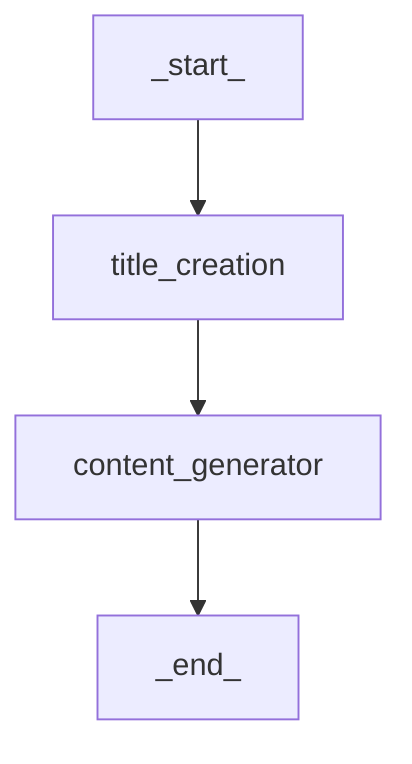
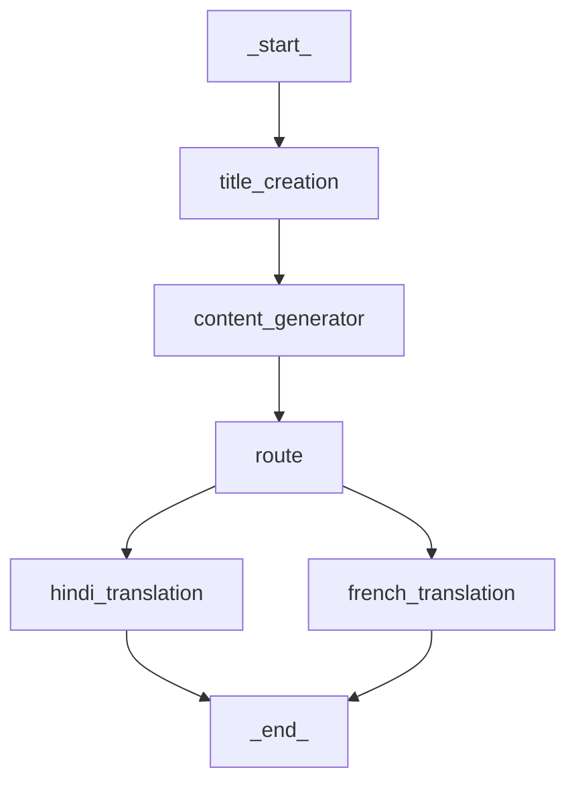

# 🧠 PolyBlog – AI Blog Generator (Multi-Language Agentic AI)

This project demonstrates a modular **Agentic AI** system using **LangGraph** to generate blogs from a given topic. The system supports both **basic blog generation** and **multi-language translation workflows**, allowing content creation in English, Hindi, or French.

LangGraph enables the design of flexible, stateful workflows using language model agents — ideal for structured, multi-step tasks like content generation and translation.

---

## 🗂️ Project Variants

### 1. 📝 Basic Blog Generation

* **Input:** Topic
* **Output:** Blog content (English)
* **Workflow:**

  * `title_creation`: Generates a suitable blog title.
  * `content_generator`: Creates a blog body based on the title.

### 2. 🌐 Blog Generation in Different Languages

* **Input:** Topic
* **Output:** Blog content in **Hindi** or **French**
* **Workflow:**

  * `title_creation`: Generates the blog title.
  * `content_generator`: Creates a blog body in English.
  * `route`: Determines translation path based on target language.
  * `hindi_translation` / `french_translation`: Translates content accordingly.

---

## ⚙️ API Workflow (FastAPI Integration)

The project provides a FastAPI backend with the following endpoint:

* **POST `/blogs`**

  * **Input JSON:** `{ "topic": "Your Topic" }`
  * **Output JSON:** `{ "data": "Generated Blog Content" }`
  * **Process:**

    1. Receives topic via POST request.
    2. Initializes **GroqLLM** (Large Language Model backend).
    3. Constructs LangGraph workflow using `GraphBuilder`.
    4. Invokes graph to generate blog content (English or translated).
    5. Returns structured JSON response.

---

## ⚙️ Workflow Diagrams

### 📄 Basic Flow `{Topic}`



### 🌍 Multi-Language Flow



---

## 📦 Setup Instructions

### 1. Clone the repository

```bash
git clone https://github.com/rayrajbir/PolyBlog-AI_Blog_Generator.git
cd PolyBlog-AI_Blog_Generator
```

### 2. Install dependencies

```bash
pip install -r requirements.txt
```

### 3. Set up environment

Create a `.env` file:

```env
LANGCHAIN_API_KEY=your_groq_api_key
```

### 4. Run the FastAPI app

```bash
python app.py
```

* Open `http://localhost:8000/docs` to access the interactive API documentation.
* Use the `/blogs` POST endpoint to generate blogs dynamically.

---

## 📁 File Structure

```
.
├── src/
│   ├── agents/
│   │   ├── title_creator.py
│   │   ├── content_generator.py
│   │   ├── translator.py
│   │   └── router.py
│   ├── graphs/
│   │   ├── basic_graph.py
│   │   └── multilang_graph.py
│   ├── llms/
│   │   └── groqllm.py
│   └── main/
│       ├── run_basic.py
│       └── run_multilang.py
├── app.py
├── .env
├── requirements.txt
└── README.md
```

---

## 🧠 Key Technologies

* **LangGraph**: State machine framework for modular LLM agents
* **LangChain**: LLM orchestration and memory management
* **Groq LLM**: Large Language Model for content generation and translation
* **FastAPI**: Web framework for API-based blog generation
* **Python**: Core logic, API, and workflow orchestration

---

## ✨ Future Improvements

* Add support for additional languages via external APIs
* Integrate grammar correction APIs (Grammarly/Ginger)
* Develop a user-friendly interface with Streamlit or Gradio
* Add blog summarization and metadata generation

---

## 📝 License

This project is licensed under the **MIT License**.
